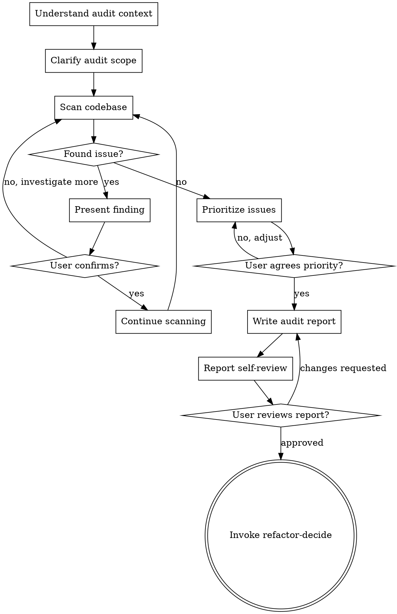

# refactor-audit (Code Audit)

> Discovering problems is more important than solving them.

## HARD-GATE

Do NOT proceed to refactor-decide until you have presented the audit report and the user has approved it. This applies to EVERY audit regardless of perceived simplicity.

## Anti-Pattern: "This Code Is Fine"

Every audit goes through this process. A quick scan, a single module check, a "looks good" — all of them. "Simple" codebases are where hidden problems cause the most wasted refactoring effort. The audit can be quick (a few focused questions for truly small projects), but you MUST present findings and get approval.

## Checklist

You MUST create a task for each of these items and complete them in order:

1. **Understand audit context** — check project type, tech stack, recent changes
2. **Clarify audit scope** — one question at a time, understand focus/constraints/goals
3. **Scan codebase** — identify code smells, seams, technical debt
4. **Present findings incrementally** — show problems as discovered, get confirmation
5. **Prioritize issues** — propose priority ranking with reasoning
6. **Write audit report** — save to `docs/refactor/audits/YYYY-MM-DD-<project>-audit.md`
7. **Report self-review** — check for completeness, accuracy, methodology alignment
8. **User reviews report** — ask user to review before proceeding
9. **Transition to decision** — invoke refactor-decide for next step

## Process Flow

**The terminal state is invoking refactor-decide.** Do NOT invoke refactor-execute or any implementation skill directly.

## The Process

**Understanding the context:**

- Check project type (Node.js, Python, Go, etc.) via config files
- Identify tech stack versions and key dependencies
- Review recent commits for change patterns
- Note test coverage if available

**Clarifying the scope:**

- Ask questions one at a time to refine the audit focus
- Prefer multiple choice questions when possible
- Focus on understanding: scope boundaries, pain points, success criteria
- Key questions:
  - "What is the audit scope? A. Full codebase B. Core modules C. Specific directory"
  - "What is the audit focus? A. Code quality B. Architecture C. Performance D. Security E. Comprehensive"
  - "Are there any known pain points or concerns?"

**Scanning the codebase:**

- Apply methodology-based detection:

| Methodology | Detection Focus |
|-------------|-----------------|
| Fowler "Refactoring" | Code smells: duplicated code, long methods, large classes, long parameter lists |
| Feathers "Working Effectively with Legacy Code" | Seams: safe modification points, test hooks |
| Progressive Refactoring | Coupling, circular dependencies, module boundaries |

- When you find an issue:
  1. Present the finding with methodology reference
  2. Ask: "Is this issue worth addressing? A. Yes, continue B. No, skip C. Need more analysis"
  3. Adjust based on user response

**Prioritizing issues:**

- Propose priority ranking based on:
  - Severity (High/Medium/Low)
  - Impact scope
  - Effort to fix
- Present ranking and ask: "Is this priority ranking reasonable?"
- Adjust based on feedback

## After the Audit

**Documentation:**

- Write the audit report to `docs/refactor/audits/YYYY-MM-DD-<project>-audit.md`
- Commit the report to git

**Report Self-Review:**
After writing the report, look at it with fresh eyes:

1. **Completeness check:** Did I cover all issues discussed? Any areas skipped?
2. **Methodology alignment:** Are code smells correctly identified with methodology references?
3. **Accuracy check:** Are file paths and line numbers correct?
4. **Actionability check:** Are recommendations specific enough to act on?

Fix any issues inline. No need to re-review — just fix and move on.

**User Review Gate:**
After the self-review passes, ask the user to review the written report:

> "Audit report saved to `docs/refactor/audits/<filename>.md`. Please review and let me know if you want to make any changes before we proceed to decision analysis."

Wait for the user's response. If they request changes, make them and re-run the self-review. Only proceed once the user approves.

**Next Step:**

- Invoke the refactor-decide skill to analyze refactoring decisions
- Do NOT invoke any other skill. refactor-decide is the next step.

## Key Principles

- **One question at a time** - Don't overwhelm with multiple questions
- **Methodology grounded** - Every finding should reference established refactoring methodology
- **Incremental validation** - Present findings as discovered, get confirmation
- **Be flexible** - Go back and investigate more when user questions a finding
- **User drives focus** - Let user's concerns guide the audit depth

## Code Smell Reference (Fowler)

| Code Smell | Detection | Severity |
|------------|-----------|----------|
| Duplicated Code | Similar code blocks | High |
| Long Method | Method > 50 lines | High |
| Large Class | Class > 500 lines | Medium |
| Long Parameter List | Parameters > 4 | Medium |
| Divergent Change | One class changes for multiple reasons | High |
| Shotgun Surgery | One change requires modifying multiple classes | High |

## Seam Types (Feathers)

| Seam Type | Description | Example |
|-----------|-------------|---------|
| Interface Layer | Isolate via interface | DataSource interface |
| Adapter Layer | Wrap external dependencies | API Client Adapter |
| Configuration Layer | Switch behavior via config | Feature Flag |
| Test Hook | Inject test doubles | Dependency injection |
