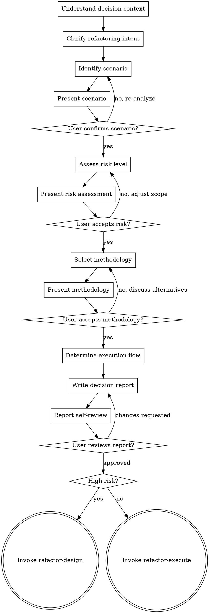

# refactor-decide (Refactoring Decision)

> First determine if refactoring is needed, then decide how to refactor.

## HARD-GATE

Do NOT proceed to refactor-design until you have presented the decision report and the user has approved it. This applies to EVERY decision regardless of perceived simplicity.

## Anti-Pattern: "Just Start Refactoring"

Every decision goes through this process. A quick fix, a straightforward migration, an obvious improvement — all of them. "Obvious" refactoring decisions are where wrong assumptions cause the most rework. The decision can be quick (a few focused questions for truly simple scenarios), but you MUST present the decision and get approval.

## Checklist

You MUST create a task for each of these items and complete them in order:

1. **Understand decision context** — review audit report, understand user's refactoring goal
2. **Clarify refactoring intent** — one question at a time, understand purpose/constraints/success criteria
3. **Identify refactoring scenario** — classify the type of refactoring needed
4. **Assess risk level** — evaluate complexity, test coverage, impact scope
5. **Select methodology** — propose approach with reasoning, get user confirmation
6. **Determine execution flow** — decide if simplified or full flow needed
7. **Write decision report** — save to `docs/refactor/decisions/YYYY-MM-DD-<project>-decision.md`
8. **Report self-review** — check for completeness, risk accuracy, methodology fit
9. **User reviews report** — ask user to review before proceeding
10. **Transition to design** — invoke refactor-design for high-risk, or refactor-execute for low-risk

## Process Flow

**The terminal state is invoking refactor-design (high risk) or refactor-execute (low risk).**

## The Process

**Understanding the context:**

- Review the audit report from previous step
- Understand what problems were identified
- Note user's stated refactoring goals

**Clarifying the intent:**

- Ask questions one at a time to refine the refactoring goal
- Prefer multiple choice questions when possible
- Focus on understanding: purpose, constraints, success criteria
- Key questions:
  - "What is the primary goal of this refactoring? A. Performance optimization B. Code simplification C. Structural reorganization D. Technology upgrade"
  - "What constraints exist? A. Must maintain API compatibility B. Must have zero downtime C. Time pressure D. No special constraints"
  - "What are the success criteria?"

**Identifying the scenario:**

- Classify the refactoring scenario based on user input and audit findings:

| Scenario | Keywords | Typical Risk |
|----------|----------|--------------|
| Small-scale optimization | "optimize", "clean up", "simplify" | Low |
| Code style unification | "unify style", "standardize" | Low |
| Tech stack upgrade | "upgrade", "update dependencies" | Medium |
| Framework migration | "migrate to", "switch to" | High |
| Legacy code refactoring | "legacy", "old code", "technical debt" | High |
| Large-scale refactoring | "refactor entire", "complete rewrite" | High |

- Present the identified scenario and ask: "Identified as [scenario]. Is this correct?"

**Assessing risk:**

- Evaluate risk level based on multiple factors:

| Risk Level | Conditions | Test Requirement |
|------------|------------|------------------|
| Low | Single file, simple logic, has tests | Tests pass |
| Medium | Multiple files, complex logic | 80%+ coverage |
| High | Core modules, framework migration | 100% coverage |
| Critical | Database changes, architecture rewrite | Full regression |

- Present risk assessment with reasoning and ask: "Risk assessed as [level]. Do you accept?"

**Selecting methodology:**

- Propose methodology based on scenario:

| Scenario | Recommended Methodology |
|----------|------------------------|
| Small-scale optimization | Boy Scout Rule |
| Code style unification | ESLint + Prettier |
| Tech stack upgrade | Phased Migration |
| Framework migration | Progressive Migration |
| Legacy code refactoring | Strangler Fig Pattern |
| Large-scale refactoring | Wave Mechanism |

- Present with alternatives and ask: "Recommend using [methodology]. Do you accept?"

**Determining execution flow:**

- Based on risk level:
  - Low → Simplified flow: execute → verify
  - Medium/High/Critical → Full flow: design → review → plan → execute → verify

## After the Decision

**Documentation:**

- Write the decision report to `docs/refactor/decisions/YYYY-MM-DD-<project>-decision.md`
- Commit the report to git

**Report Self-Review:**
After writing the report, look at it with fresh eyes:

1. **Scenario accuracy:** Does the scenario classification match user's intent?
2. **Risk completeness:** Did I consider all risk factors? Test coverage, impact scope, reversibility?
3. **Methodology fit:** Is the proposed methodology appropriate for the scenario and risk level?
4. **Flow correctness:** Does the execution flow match the risk level?

Fix any issues inline. No need to re-review — just fix and move on.

**User Review Gate:**
After the self-review passes, ask the user to review the written report:

> "Decision report saved to `docs/refactor/decisions/<filename>.md`. Please review and let me know if you want to make any changes before we proceed to the next phase."

Wait for the user's response. If they request changes, make them and re-run the self-review. Only proceed once the user approves.

**Next Step:**

- If high risk: Invoke refactor-design skill
- If low risk: Invoke refactor-execute skill
- Do NOT invoke any other skill.

## Key Principles

- **One question at a time** - Don't overwhelm with multiple questions
- **Risk drives flow** - Risk level determines execution flow
- **Methodology grounded** - Every recommendation references established methodology
- **User drives decisions** - Let user's constraints and goals guide the decision
- **Be flexible** - Go back and re-analyze when user questions a conclusion

## Methodology Reference

### Boy Scout Rule
> Leave the campground cleaner than you found it.

Improve a little bit of surrounding code each time you modify it. Suitable for small-scale optimization.

### Phased Migration
> Upgrade in stages to reduce risk.

1. Assess upgrade impact scope
2. Upgrade non-core dependencies
3. Upgrade core dependencies
4. Fix breaking changes

### Progressive Migration
> Run old and new frameworks in parallel, switch gradually.

1. Establish dual-run (old and new in parallel)
2. Migrate modules (starting with non-core modules)
3. Full switch (with monitoring and rollback plan)

### Strangler Fig Pattern
> Build new features with new architecture, migrate old features gradually.

- New features → New architecture
- Old features → Gradual migration
- Eventually → Old system completely replaced

### Wave Mechanism
> Execute independent tasks in parallel, dependent tasks sequentially.

- Wave 1: Multiple agents process independent modules in parallel
- Wave 2: Process tasks that depend on Wave 1
- Verify after each Wave completes
