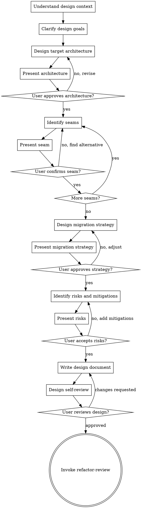

# refactor-design (Design Document)

> No design, no action.

## HARD-GATE

Do NOT proceed to refactor-review until you have presented the design document and the user has approved it. This applies to EVERY design regardless of perceived simplicity.

## Anti-Pattern: "The Design Is Obvious"

Every design goes through this process. A straightforward migration, a simple extraction, an obvious restructuring — all of them. "Obvious" designs are where missed edge cases cause the most implementation failures. The design can be concise (a few focused sections for truly simple refactoring), but you MUST present it and get approval.

## Checklist

You MUST create a task for each of these items and complete them in order:

1. **Understand design context** — review decision report, audit report, understand constraints
2. **Clarify design goals** — one question at a time, understand target state/constraints/success criteria
3. **Design target architecture** — define the end state, module boundaries, interfaces
4. **Identify seams** — find safe modification points, present each for confirmation
5. **Design migration strategy** — plan the transition path based on scenario type
6. **Identify risks and mitigations** — list risks with mitigation strategies
7. **Present design sections** — show design incrementally, get approval after each section
8. **Write design document** — save to `docs/refactor/designs/YYYY-MM-DD-<project>-design.md`
9. **Design self-review** — check for completeness, seam safety, migration feasibility
10. **User reviews design** — ask user to review before proceeding
11. **Transition to review** — invoke refactor-review for automated review

## Process Flow



**The terminal state is invoking refactor-review.** Do NOT invoke refactor-execute or any implementation skill directly.

## The Process

**Understanding the context:**

- Review the decision report: scenario type, risk level, selected methodology
- Review the audit report: identified problems, code smells, priority issues
- Understand constraints: API compatibility, zero-downtime, time pressure

**Clarifying design goals:**

- Ask questions one at a time to refine the design direction
- Prefer multiple choice questions when possible
- Focus on understanding: target state, constraints, success criteria
- Key questions:
  - "What is the core goal of the target architecture?"
  - "What are the non-negotiable constraints?"
  - "How do we determine if refactoring is successful?"

**Designing target architecture:**

- Define the end state:
  - Module boundaries and responsibilities
  - Interface contracts between modules
  - Data flow and dependencies
- Present architecture and ask: "Does this target architecture meet expectations?"

**Identifying seams:**

> Seam: A place where you can safely modify without affecting callers.

- Find safe modification points based on Feathers' methodology:

| Seam Type | Description | Safety Level |
|-----------|-------------|--------------|
| Interface Layer | Isolate via interface | High |
| Adapter Layer | Wrap external dependencies | High |
| Configuration Layer | Switch behavior via config | Medium |
| Test Hook | Inject test doubles | High |

- For each seam identified:
  1. Present the seam with location and modification type
  2. Ask: "Can this seam be safely modified? A. Yes B. No, has risk C. Need more analysis"
  3. Adjust based on user response

**Designing migration strategy:**

- Based on scenario type from decision report:

| Scenario | Migration Strategy Design |
|----------|--------------------------|
| Framework migration | API mapping table + dual-run plan + switch strategy |
| Large-scale refactoring | Wave division + file ownership + agent coordination |
| Legacy code refactoring | Strangler fig path + characteristic test coverage |
| Tech stack upgrade | Dependency upgrade order + breaking changes handling |

- Present strategy and ask: "Is this migration strategy feasible?"

**Identifying risks and mitigations:**

- List risks with mitigation strategies:

| Risk | Impact | Mitigation |
|------|--------|------------|
| Behavior change | High | Characteristic tests + dual-run verification |
| Performance degradation | Medium | Benchmarks + monitoring |
| Difficult rollback | High | Mark starting point + small commits |

- Present risks and ask: "Are these risks and mitigations sufficient?"

## After the Design

**Documentation:**

- Write the design document to `docs/refactor/designs/YYYY-MM-DD-<project>-design.md`
- Commit the document to git

**Design Self-Review:**
After writing the document, look at it with fresh eyes:

1. **Architecture completeness:** Are all modules defined? Interface contracts clear?
2. **Seam safety:** Can each seam be modified without breaking callers?
3. **Migration feasibility:** Is the migration strategy executable step by step?
4. **Risk coverage:** Are major risks identified with mitigations?
5. **Methodology alignment:** Does the design follow the selected methodology?

Fix any issues inline. No need to re-review — just fix and move on.

**User Review Gate:**
After the self-review passes, ask the user to review the written design:

> "Design document saved to `docs/refactor/designs/<filename>.md`. Please review and let me know if you want to make any changes before we proceed to automated review."

Wait for the user's response. If they request changes, make them and re-run the self-review. Only proceed once the user approves.

**Next Step:**

- Invoke the refactor-review skill for automated review
- Do NOT invoke any other skill. refactor-review is the next step.

## Key Principles

- **One question at a time** - Don't overwhelm with multiple questions
- **Seams are sacred** - Every seam must be confirmed safe before proceeding
- **Methodology grounded** - Design follows the methodology selected in decide phase
- **Incremental validation** - Present each section, get approval before moving on
- **Be flexible** - Go back and redesign when user questions a decision

## Output Format

```markdown
# Refactoring Design Document

## Target Architecture
[Architecture description/diagram]

## Seam List
| Seam | Location | Type | Modification | Risk Level |
|------|----------|------|--------------|------------|
| ... | ... | ... | ... | ... |

## Migration Strategy
[Detailed strategy based on scenario type]

### API Mapping Table (Framework Migration)
| Source API | Target API | Behavior Difference | Handling |
|------------|------------|---------------------|----------|
| ... | ... | ... | ... |

### Wave Division (Large-scale Refactoring)
- Wave 1: [Module A] + [Module B] (parallel)
- Wave 2: [Module C] (depends on Wave 1)

## Risks and Mitigations
| Risk | Impact | Mitigation |
|------|--------|------------|
| ... | ... | ... |

## Success Criteria
- [ ] All tests pass
- [ ] Behavior consistency verified
- [ ] No significant performance degradation
```
